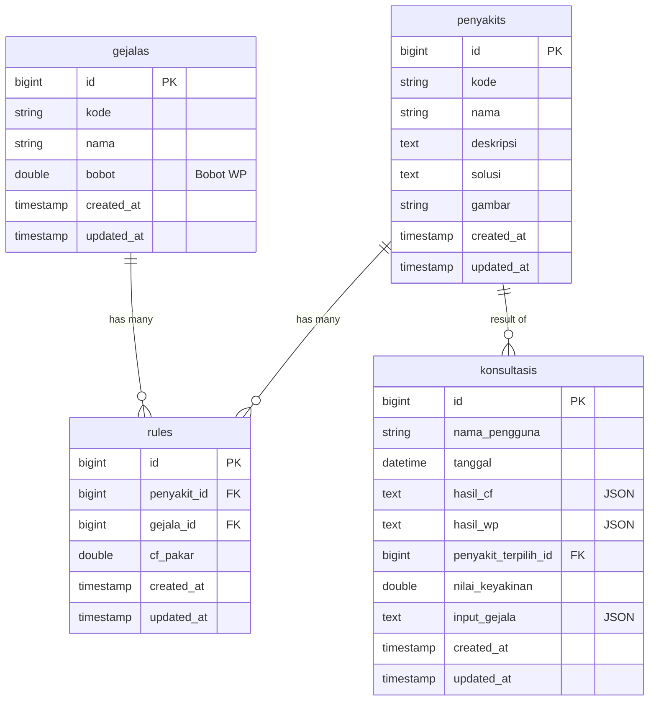

# Entity Relationship Diagram (ERD) - Sistem Pakar Cabai

Berikut adalah visualisasi hubungan antar tabel dalam database `sispak_cabe`.

## Penjelasan Relasi

1.  **Rules (Aturan)**

    -   Tabel `rules` adalah tabel pivot (penghubung) antara `penyakits` dan `gejalas`.
    -   **One-to-Many**: Satu `penyakit` bisa memiliki banyak `rule` (banyak gejala).
    -   **One-to-Many**: Satu `gejala` bisa ada di banyak `rule` (banyak penyakit).
    -   Aturan ini menyimpan nilai `cf_pakar` yang menunjukkan seberapa yakin pakar bahwa gejala tersebut menyebabkan penyakit tersebut.

2.  **Konsultasi**
    -   Tabel `konsultasis` menyimpan riwayat diagnosa user.
    -   **One-to-Many**: Satu `penyakit` bisa menjadi hasil dari banyak `konsultasi`.
    -   Kolom `penyakit_terpilih_id` adalah Foreign Key yang merujuk ke tabel `penyakits`.
