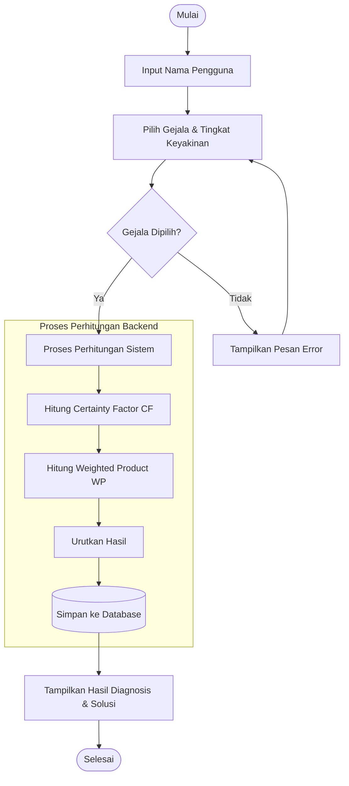
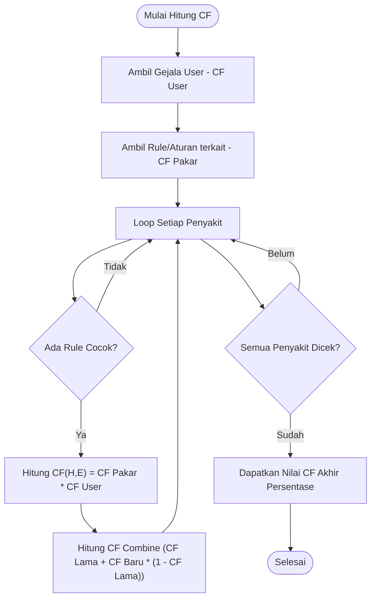

# Flowchart Sistem Pakar Cabai

Berikut adalah alur kerja (flowchart) yang diperbarui.

## 1. Alur Konsultasi (User)

Alur ini menggambarkan proses diagnosa penyakit tanaman cabai oleh pengguna.



## 2. Alur Perhitungan CF (Detail)

Penjelasan logis bagaimana nilai CF didapatkan.



## 3. Alur Perhitungan WP (Detail)

Penjelasan logis bagaimana nilai WP didapatkan (Vektor S dan Vektor V).

```mermaid
graph TD
    StartWP([Mulai Hitung WP]) --> GetUser[Ambil Gejala User & Bobot]
    GetUser --> LoopAlt["Loop Setiap Penyakit (Alternatif)"]

    LoopAlt --> InitS[Inisialisasi S = 1]
    InitS --> LoopKrit["Loop Setiap Gejala (Kriteria)"]
    LoopKrit --> HitungPangkat["Hitung S_item = (CF Pakar ^ Bobot Gejala)"]
    HitungPangkat --> KaliS[S = S * S_item]

    KaliS --> CekKrit{Gejala Lain?}
    CekKrit -- Ya --> LoopKrit
    CekKrit -- Tidak --> SimpanS[Simpan Nilai S]

    SimpanS --> CekAlt{Penyakit Lain?}
    CekAlt -- Ya --> LoopAlt
    CekAlt -- Tidak --> HitungTotal[Hitung Total Sigma S]

    HitungTotal --> LoopV[Loop Hitung Vektor V]
    LoopV --> HitungVi["V = S / Total Sigma S"]
    HitungVi --> CekV{Lanjut?}

    CekV -- Ya --> LoopV
    CekV -- Tidak --> Rank[Urutkan Hasil (Desc)]
    Rank --> SelesaiWP([Selesai])
```

````

## 4. Alur Proses Diagnosa Lengkap (Gabungan CF & WP)

Menjelaskan urutan eksekusi metode Certainty Factor (CF) dan Weighted Product (WP) dalam satu sesi konsultasi.

```mermaid
graph TD
    StartGab([Mulai Diagnosa]) --> UserInput[User Input Gejala & Keyakinan]
    UserInput --> Validasi{Valid?}
    Validasi -- Tidak --> Error[Tampilkan Error]
    Error --> UserInput

    Validasi -- Ya --> ParallelStart[Mulai Perhitungan Paralel/Sekuensial]

    subgraph MethodCF [Metode Certainty Factor]
        ParallelStart --> HitungCF[Hitung CF per Rule]
        HitungCF --> CombineCF[Hitung CF Combine]
        CombineCF --> HasilCF[Dapatkan Nilai % CF]
    end

    subgraph MethodWP [Metode Weighted Product]
        ParallelStart --> HitungS[Hitung Vektor S (Si)]
        HitungS --> HitungV[Hitung Vektor V (Vi)]
        HitungV --> HasilWP[Dapatkan Nilai % WP]
    end

    HasilCF --> FinalDec[Penentuan Hasil Akhir]
    HasilWP --> FinalDec

    FinalDec --> SaveDB[(Simpan Riwayat)]
    SaveDB --> ShowResult[Tampilkan Halaman Hasil]
    ShowResult --> Finish([Selesai])
````

## 5. Alur Admin (Manajemen Data)

Alur pengelolaan data oleh admin.

```mermaid
graph TD
    Login([Start]) --> Dashboard[Dashboard Admin]

    Dashboard --> Menu{Pilih Menu}

    Menu --> MP[Kelola Penyakit]
    MP --> CRUD_P[Tambah/Edit/Hapus Penyakit]

    Menu --> MG[Kelola Gejala]
    MG --> CRUD_G[Tambah/Edit/Hapus Gejala + Bobot]

    Menu --> MR[Kelola Rule Base]
    MR --> CRUD_R[Hubungkan Penyakit & Gejala + CF Pakar]

    CRUD_P --> DB[(Database)]
    CRUD_G --> DB
    CRUD_R --> DB

    Menu --> MK[Kelola Riwayat]
    MK --> View_Hist[Lihat Daftar & Detail]
    MK --> Del_Hist[Hapus Riwayat]

    Del_Hist --> DB
```
