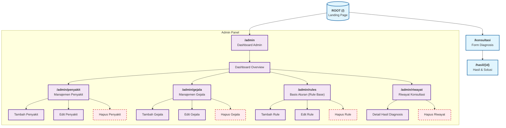

# Sitemap - Sistem Pakar Cabai

Berikut adalah struktur halaman (Sitemap) dari aplikasi Sistem Pakar Tanaman Cabai.

## Deskripsi Halaman

### Halaman Publik (User)

1.  **Beranda (/)**: Halaman utama berisi informasi tentang sistem pakar.
2.  **Konsultasi (/konsultasi)**: Form untuk pengguna memasukkan data diri dan memilih gejala.
3.  **Hasil Diagnosis (/hasil/{id})**: Menampilkan penyakit yang teridentifikasi, nilai keyakinan (CF & WP), serta solusi penanganan.

### Halaman Admin

1.  **Dashboard (/admin)**: Ringkasan jumlah data (Penyakit, Gejala, Rule, History Konsultasi).
2.  **Manajemen Penyakit**: Modul untuk menambah, mengubah, dan menghapus data penyakit & solusi.
3.  **Manajemen Gejala**: Modul untuk mengelola data gejala dan bobot (untuk WP).
4.  **Basis Aturan (Rule Base)**: Tempat menghubungkan Penyakit dengan Gejala dan menentukan nilai CF Pakar.
5.  **Riwayat Konsultasi**: Modul untuk melihat histori diagnosis pengguna, melihat detail perhitungan, dan menghapus data.
